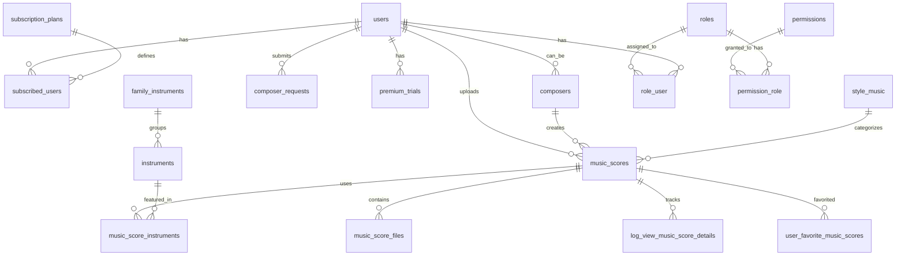

# 🗄️ Esquema de Base de Datos - Faristol

## 📋 Descripción General

El esquema de base de datos de Faristol está diseñado para soportar un sistema completo de gestión de partituras musicales con usuarios, compositores, suscripciones y contenido multimedia.

## 📊 Diagrama de Relaciones



## 📋 Tablas Principales

### 👥 Usuarios y Autenticación

#### users
```sql
CREATE TABLE users (
    id BIGINT UNSIGNED AUTO_INCREMENT PRIMARY KEY,
    name VARCHAR(255) NOT NULL,
    email VARCHAR(255) UNIQUE NOT NULL,
    telephone VARCHAR(50) NULL,
    email_verified_at TIMESTAMP NULL,
    password VARCHAR(255) NOT NULL,
    status TINYINT(1) DEFAULT 1,
    remember_token VARCHAR(100) NULL,
    created_at TIMESTAMP NULL,
    updated_at TIMESTAMP NULL,
    
    INDEX idx_email (email),
    INDEX idx_status (status),
    INDEX idx_created_at (created_at)
);
```

**Descripción**: Tabla principal de usuarios del sistema.
- `status`: 1 = activo, 0 = suspendido
- `telephone`: Formato internacional (ej: "(+34)123456789")

#### personal_access_tokens
```sql
CREATE TABLE personal_access_tokens (
    id BIGINT UNSIGNED AUTO_INCREMENT PRIMARY KEY,
    tokenable_type VARCHAR(255) NOT NULL,
    tokenable_id BIGINT UNSIGNED NOT NULL,
    name VARCHAR(255) NOT NULL,
    token VARCHAR(64) UNIQUE NOT NULL,
    abilities TEXT NULL,
    last_used_at TIMESTAMP NULL,
    expires_at TIMESTAMP NULL,
    created_at TIMESTAMP NULL,
    updated_at TIMESTAMP NULL,
    
    INDEX idx_tokenable (tokenable_type, tokenable_id),
    INDEX idx_token (token)
);
```

**Descripción**: Tokens de acceso para API (Laravel Sanctum).

### 🎭 Roles y Permisos

#### roles
```sql
CREATE TABLE roles (
    id BIGINT UNSIGNED AUTO_INCREMENT PRIMARY KEY,
    name VARCHAR(255) UNIQUE NOT NULL,
    display_name VARCHAR(255) NULL,
    description TEXT NULL,
    created_at TIMESTAMP NULL,
    updated_at TIMESTAMP NULL
);
```

**Roles del sistema**: `superadmin`, `musician`, `composer`

#### permissions
```sql
CREATE TABLE permissions (
    id BIGINT UNSIGNED AUTO_INCREMENT PRIMARY KEY,
    name VARCHAR(255) UNIQUE NOT NULL,
    display_name VARCHAR(255) NULL,
    description TEXT NULL,
    created_at TIMESTAMP NULL,
    updated_at TIMESTAMP NULL
);
```

#### role_user
```sql
CREATE TABLE role_user (
    id BIGINT UNSIGNED AUTO_INCREMENT PRIMARY KEY,
    role_id BIGINT UNSIGNED NOT NULL,
    user_id BIGINT UNSIGNED NOT NULL,
    user_type VARCHAR(255) NOT NULL,
    created_at TIMESTAMP NULL,
    updated_at TIMESTAMP NULL,
    
    FOREIGN KEY (role_id) REFERENCES roles(id) ON DELETE CASCADE,
    FOREIGN KEY (user_id) REFERENCES users(id) ON DELETE CASCADE,
    UNIQUE KEY unique_role_user (user_id, role_id, user_type)
);
```

### 🎼 Compositores

#### composers
```sql
CREATE TABLE composers (
    id BIGINT UNSIGNED AUTO_INCREMENT PRIMARY KEY,
    name VARCHAR(255) NOT NULL,
    biography TEXT NULL,
    birth_date DATE NULL,
    death_date DATE NULL,
    nationality VARCHAR(100) NULL,
    period VARCHAR(100) NULL,
    image_url VARCHAR(500) NULL,
    users_id BIGINT UNSIGNED NULL,
    status TINYINT(1) DEFAULT 1,
    created_at TIMESTAMP NULL,
    updated_at TIMESTAMP NULL,
    
    FOREIGN KEY (users_id) REFERENCES users(id) ON DELETE SET NULL,
    INDEX idx_name (name),
    INDEX idx_nationality (nationality),
    INDEX idx_period (period),
    INDEX idx_status (status)
);
```

#### composer_requests
```sql
CREATE TABLE composer_requests (
    id BIGINT UNSIGNED AUTO_INCREMENT PRIMARY KEY,
    user_id BIGINT UNSIGNED NOT NULL,
    name VARCHAR(255) NOT NULL,
    real_name VARCHAR(255) NULL,
    biography TEXT NOT NULL,
    birth_date DATE NOT NULL,
    death_date DATE NULL,
    nationality VARCHAR(100) NOT NULL,
    musical_education TEXT NULL,
    genres JSON NULL,
    portfolio_url VARCHAR(500) NULL,
    sample_works JSON NULL,
    social_media JSON NULL,
    status ENUM('pending', 'approved', 'rejected', 'reviewing') DEFAULT 'pending',
    reviewed_at TIMESTAMP NULL,
    reviewed_by BIGINT UNSIGNED NULL,
    review_notes TEXT NULL,
    composer_id BIGINT UNSIGNED NULL,
    created_at TIMESTAMP NULL,
    updated_at TIMESTAMP NULL,
    
    FOREIGN KEY (user_id) REFERENCES users(id) ON DELETE CASCADE,
    FOREIGN KEY (reviewed_by) REFERENCES users(id) ON DELETE SET NULL,
    FOREIGN KEY (composer_id) REFERENCES composers(id) ON DELETE SET NULL,
    INDEX idx_status (status),
    INDEX idx_user_id (user_id)
);
```

### 🎹 Instrumentos

#### family_instruments
```sql
CREATE TABLE family_instruments (
    id BIGINT UNSIGNED AUTO_INCREMENT PRIMARY KEY,
    name VARCHAR(255) NOT NULL,
    description TEXT NULL,
    status TINYINT(1) DEFAULT 1,
    created_at TIMESTAMP NULL,
    updated_at TIMESTAMP NULL,
    
    INDEX idx_name (name),
    INDEX idx_status (status)
);
```

#### instruments
```sql
CREATE TABLE instruments (
    id BIGINT UNSIGNED AUTO_INCREMENT PRIMARY KEY,
    name VARCHAR(255) NOT NULL,
    description TEXT NULL,
    family_instrument_id BIGINT UNSIGNED NOT NULL,
    status TINYINT(1) DEFAULT 1,
    created_at TIMESTAMP NULL,
    updated_at TIMESTAMP NULL,
    
    FOREIGN KEY (family_instrument_id) REFERENCES family_instruments(id) ON DELETE CASCADE,
    INDEX idx_name (name),
    INDEX idx_family (family_instrument_id),
    INDEX idx_status (status)
);
```

### 🎨 Estilos Musicales

#### style_music
```sql
CREATE TABLE style_music (
    id BIGINT UNSIGNED AUTO_INCREMENT PRIMARY KEY,
    name VARCHAR(255) NOT NULL,
    description TEXT NULL,
    status TINYINT(1) DEFAULT 1,
    created_at TIMESTAMP NULL,
    updated_at TIMESTAMP NULL,
    
    INDEX idx_name (name),
    INDEX idx_status (status)
);
```

### 🎼 Partituras

#### music_scores
```sql
CREATE TABLE music_scores (
    id BIGINT UNSIGNED AUTO_INCREMENT PRIMARY KEY,
    name VARCHAR(255) NOT NULL,
    description TEXT NULL,
    composer_id BIGINT UNSIGNED NOT NULL,
    style_music_id BIGINT UNSIGNED NOT NULL,
    user_id BIGINT UNSIGNED NOT NULL,
    difficulty ENUM('beginner', 'intermediate', 'advanced') DEFAULT 'beginner',
    duration_minutes INT UNSIGNED NULL,
    key_signature VARCHAR(50) NULL,
    time_signature VARCHAR(20) NULL,
    tempo VARCHAR(100) NULL,
    pdf_pages INT UNSIGNED DEFAULT 0,
    thumbnail_url VARCHAR(500) NULL,
    status ENUM('draft', 'published', 'archived') DEFAULT 'draft',
    is_premium TINYINT(1) DEFAULT 0,
    tags JSON NULL,
    created_at TIMESTAMP NULL,
    updated_at TIMESTAMP NULL,
    
    FOREIGN KEY (composer_id) REFERENCES composers(id) ON DELETE CASCADE,
    FOREIGN KEY (style_music_id) REFERENCES style_music(id) ON DELETE CASCADE,
    FOREIGN KEY (user_id) REFERENCES users(id) ON DELETE CASCADE,
    INDEX idx_name (name),
    INDEX idx_composer (composer_id),
    INDEX idx_style (style_music_id),
    INDEX idx_user (user_id),
    INDEX idx_difficulty (difficulty),
    INDEX idx_status (status),
    INDEX idx_created_at (created_at),
    FULLTEXT idx_search (name, description)
);
```

#### music_score_instruments
```sql
CREATE TABLE music_score_instruments (
    id BIGINT UNSIGNED AUTO_INCREMENT PRIMARY KEY,
    music_score_id BIGINT UNSIGNED NOT NULL,
    instrument_id BIGINT UNSIGNED NOT NULL,
    created_at TIMESTAMP NULL,
    updated_at TIMESTAMP NULL,
    
    FOREIGN KEY (music_score_id) REFERENCES music_scores(id) ON DELETE CASCADE,
    FOREIGN KEY (instrument_id) REFERENCES instruments(id) ON DELETE CASCADE,
    UNIQUE KEY unique_score_instrument (music_score_id, instrument_id)
);
```

#### music_score_files
```sql
CREATE TABLE music_score_files (
    id BIGINT UNSIGNED AUTO_INCREMENT PRIMARY KEY,
    music_score_id BIGINT UNSIGNED NOT NULL,
    file_type ENUM('pdf', 'midi', 'xml', 'audio', 'image') NOT NULL,
    file_path VARCHAR(500) NOT NULL,
    file_name VARCHAR(255) NOT NULL,
    file_size BIGINT UNSIGNED NOT NULL,
    mime_type VARCHAR(100) NOT NULL,
    is_primary TINYINT(1) DEFAULT 0,
    created_at TIMESTAMP NULL,
    updated_at TIMESTAMP NULL,
    
    FOREIGN KEY (music_score_id) REFERENCES music_scores(id) ON DELETE CASCADE,
    INDEX idx_music_score (music_score_id),
    INDEX idx_file_type (file_type),
    INDEX idx_is_primary (is_primary)
);
```

### 💳 Suscripciones

#### subscription_plans
```sql
CREATE TABLE subscription_plans (
    id BIGINT UNSIGNED AUTO_INCREMENT PRIMARY KEY,
    name VARCHAR(255) NOT NULL,
    description TEXT NULL,
    type TINYINT UNSIGNED NOT NULL, -- 0=Free, 1=Basic, 2=Premium
    price DECIMAL(8,2) NOT NULL DEFAULT 0,
    currency VARCHAR(3) DEFAULT 'EUR',
    duration_days INT UNSIGNED NULL,
    features JSON NULL,
    status TINYINT(1) DEFAULT 1,
    start_date TIMESTAMP NULL,
    end_date TIMESTAMP NULL,
    created_at TIMESTAMP NULL,
    updated_at TIMESTAMP NULL,
    
    INDEX idx_type (type),
    INDEX idx_status (status),
    INDEX idx_price (price)
);
```

#### subscribed_users
```sql
CREATE TABLE subscribed_users (
    id BIGINT UNSIGNED AUTO_INCREMENT PRIMARY KEY,
    user_id BIGINT UNSIGNED NOT NULL,
    subscription_plan_id BIGINT UNSIGNED NOT NULL,
    subscription_start_date TIMESTAMP DEFAULT CURRENT_TIMESTAMP,
    subscription_end_date TIMESTAMP NULL,
    paypal_subscription_id VARCHAR(255) NULL,
    payment_method ENUM('paypal', 'stripe', 'apple', 'google') NULL,
    auto_renew TINYINT(1) DEFAULT 1,
    status ENUM('active', 'expired', 'cancelled', 'suspended') DEFAULT 'active',
    created_at TIMESTAMP NULL,
    updated_at TIMESTAMP NULL,
    
    FOREIGN KEY (user_id) REFERENCES users(id) ON DELETE CASCADE,
    FOREIGN KEY (subscription_plan_id) REFERENCES subscription_plans(id) ON DELETE CASCADE,
    INDEX idx_user (user_id),
    INDEX idx_plan (subscription_plan_id),
    INDEX idx_end_date (subscription_end_date),
    INDEX idx_status (status),
    INDEX idx_paypal (paypal_subscription_id)
);
```

#### premium_trials
```sql
CREATE TABLE premium_trials (
    id BIGINT UNSIGNED AUTO_INCREMENT PRIMARY KEY,
    user_id BIGINT UNSIGNED NOT NULL,
    used_count INT UNSIGNED DEFAULT 0,
    last_used_at TIMESTAMP NULL,
    created_at TIMESTAMP NULL,
    updated_at TIMESTAMP NULL,
    
    FOREIGN KEY (user_id) REFERENCES users(id) ON DELETE CASCADE,
    UNIQUE KEY unique_user_trial (user_id)
);
```

### 📊 Analytics y Logs

#### log_view_music_score_details
```sql
CREATE TABLE log_view_music_score_details (
    id BIGINT UNSIGNED AUTO_INCREMENT PRIMARY KEY,
    music_score_id BIGINT UNSIGNED NOT NULL,
    user_id BIGINT UNSIGNED NULL,
    ip_address VARCHAR(45) NOT NULL,
    user_agent TEXT NULL,
    session_id VARCHAR(255) NULL,
    page_number INT UNSIGNED NULL,
    view_duration INT UNSIGNED NULL, -- seconds
    device_type ENUM('desktop', 'tablet', 'mobile') NULL,
    referrer VARCHAR(500) NULL,
    created_at TIMESTAMP NULL,
    
    FOREIGN KEY (music_score_id) REFERENCES music_scores(id) ON DELETE CASCADE,
    FOREIGN KEY (user_id) REFERENCES users(id) ON DELETE SET NULL,
    INDEX idx_music_score (music_score_id),
    INDEX idx_user (user_id),
    INDEX idx_date (created_at),
    INDEX idx_ip (ip_address)
);
```

#### user_favorite_music_scores
```sql
CREATE TABLE user_favorite_music_scores (
    id BIGINT UNSIGNED AUTO_INCREMENT PRIMARY KEY,
    user_id BIGINT UNSIGNED NOT NULL,
    music_score_id BIGINT UNSIGNED NOT NULL,
    created_at TIMESTAMP NULL,
    updated_at TIMESTAMP NULL,
    
    FOREIGN KEY (user_id) REFERENCES users(id) ON DELETE CASCADE,
    FOREIGN KEY (music_score_id) REFERENCES music_scores(id) ON DELETE CASCADE,
    UNIQUE KEY unique_user_favorite (user_id, music_score_id)
);
```

### 📧 Sistema de Emails

#### email_campaigns
```sql
CREATE TABLE email_campaigns (
    id BIGINT UNSIGNED AUTO_INCREMENT PRIMARY KEY,
    name VARCHAR(255) NOT NULL,
    subject VARCHAR(255) NOT NULL,
    content LONGTEXT NOT NULL,
    template_id BIGINT UNSIGNED NULL,
    segment VARCHAR(100) NOT NULL,
    recipient_count INT UNSIGNED DEFAULT 0,
    emails_sent INT UNSIGNED DEFAULT 0,
    emails_delivered INT UNSIGNED DEFAULT 0,
    emails_bounced INT UNSIGNED DEFAULT 0,
    emails_opened INT UNSIGNED DEFAULT 0,
    emails_clicked INT UNSIGNED DEFAULT 0,
    status ENUM('draft', 'scheduled', 'sending', 'sent', 'cancelled') DEFAULT 'draft',
    send_at TIMESTAMP NULL,
    sent_at TIMESTAMP NULL,
    created_by BIGINT UNSIGNED NOT NULL,
    created_at TIMESTAMP NULL,
    updated_at TIMESTAMP NULL,
    
    FOREIGN KEY (created_by) REFERENCES users(id) ON DELETE CASCADE,
    INDEX idx_status (status),
    INDEX idx_send_at (send_at),
    INDEX idx_segment (segment)
);
```

#### email_opens
```sql
CREATE TABLE email_opens (
    id BIGINT UNSIGNED AUTO_INCREMENT PRIMARY KEY,
    campaign_id BIGINT UNSIGNED NOT NULL,
    user_id BIGINT UNSIGNED NOT NULL,
    ip_address VARCHAR(45) NOT NULL,
    user_agent TEXT NULL,
    opened_at TIMESTAMP DEFAULT CURRENT_TIMESTAMP,
    
    FOREIGN KEY (campaign_id) REFERENCES email_campaigns(id) ON DELETE CASCADE,
    FOREIGN KEY (user_id) REFERENCES users(id) ON DELETE CASCADE,
    INDEX idx_campaign (campaign_id),
    INDEX idx_user (user_id),
    INDEX idx_opened_at (opened_at)
);
```

## 🔧 Configuración de Base de Datos

### Variables de Entorno
```env
# Base de datos principal
DB_CONNECTION=mysql
DB_HOST=127.0.0.1
DB_PORT=3306
DB_DATABASE=faristol
DB_USERNAME=faristol_user
DB_PASSWORD=secure_password

# Base de datos para analytics (opcional)
ANALYTICS_DB_CONNECTION=mysql
ANALYTICS_DB_HOST=127.0.0.1
ANALYTICS_DB_PORT=3306
ANALYTICS_DB_DATABASE=faristol_analytics
ANALYTICS_DB_USERNAME=analytics_user
ANALYTICS_DB_PASSWORD=analytics_password
```

### Migraciones

#### Orden de Ejecución
1. `create_users_table`
2. `create_roles_table`
3. `create_permissions_table`
4. `create_role_user_table`
5. `create_permission_role_table`
6. `create_family_instruments_table`
7. `create_instruments_table`
8. `create_style_music_table`
9. `create_composers_table`
10. `create_composer_requests_table`
11. `create_subscription_plans_table`
12. `create_subscribed_users_table`
13. `create_premium_trials_table`
14. `create_music_scores_table`
15. `create_music_score_instruments_table`
16. `create_music_score_files_table`
17. `create_log_view_music_score_details_table`
18. `create_user_favorite_music_scores_table`
19. `create_email_campaigns_table`
20. `create_email_opens_table`

### Seeders

#### Orden de Ejecución
```bash
php artisan db:seed --class=RolesSeeder
php artisan db:seed --class=PermissionsSeeder
php artisan db:seed --class=SuperAdminSeeder
php artisan db:seed --class=FamilyInstrumentsSeeder
php artisan db:seed --class=InstrumentsSeeder
php artisan db:seed --class=StyleMusicSeeder
php artisan db:seed --class=SubscriptionPlansSeeder
php artisan db:seed --class=ComposersSeeder  # Opcional: compositores famosos
```

### Índices y Optimización

#### Índices Compuestos Importantes
```sql
-- Búsqueda de partituras
CREATE INDEX idx_music_scores_search ON music_scores (status, composer_id, style_music_id, difficulty, created_at);

-- Analytics de visualizaciones
CREATE INDEX idx_views_analytics ON log_view_music_score_details (music_score_id, created_at, user_id);

-- Suscripciones activas
CREATE INDEX idx_active_subscriptions ON subscribed_users (user_id, subscription_end_date, status);

-- Favoritos por usuario
CREATE INDEX idx_user_favorites ON user_favorite_music_scores (user_id, created_at);
```

#### Configuración MySQL
```sql
-- Optimizaciones para búsqueda fulltext
ALTER TABLE music_scores ADD FULLTEXT(name, description);
SET GLOBAL innodb_ft_min_token_size = 2;
SET GLOBAL innodb_ft_enable_stopword = 0;
```

## 📊 Consultas Comunes

### Estadísticas de Usuario
```sql
-- Partituras más vistas
SELECT 
    ms.name,
    c.name as composer,
    COUNT(lv.id) as total_views,
    COUNT(DISTINCT lv.user_id) as unique_viewers
FROM music_scores ms
LEFT JOIN composers c ON ms.composer_id = c.id
LEFT JOIN log_view_music_score_details lv ON ms.id = lv.music_score_id
WHERE ms.status = 'published'
GROUP BY ms.id, ms.name, c.name
ORDER BY total_views DESC
LIMIT 10;
```

### Analytics de Suscripciones
```sql
-- Ingresos mensuales
SELECT 
    DATE_FORMAT(su.created_at, '%Y-%m') as month,
    sp.name as plan_name,
    COUNT(*) as subscriptions,
    SUM(sp.price) as total_revenue
FROM subscribed_users su
JOIN subscription_plans sp ON su.subscription_plan_id = sp.id
WHERE sp.price > 0
GROUP BY month, sp.id, sp.name
ORDER BY month DESC, total_revenue DESC;
```

### Reportes de Compositores
```sql
-- Compositores más productivos
SELECT 
    c.name,
    c.nationality,
    COUNT(ms.id) as total_scores,
    AVG(COALESCE(stats.view_count, 0)) as avg_views_per_score
FROM composers c
LEFT JOIN music_scores ms ON c.id = ms.composer_id AND ms.status = 'published'
LEFT JOIN (
    SELECT 
        music_score_id,
        COUNT(*) as view_count
    FROM log_view_music_score_details
    GROUP BY music_score_id
) stats ON ms.id = stats.music_score_id
GROUP BY c.id, c.name, c.nationality
HAVING total_scores > 0
ORDER BY total_scores DESC, avg_views_per_score DESC
LIMIT 20;
```

---

**Documentación actualizada**: 15 de Enero, 2024  
**Versión**: v1.0  
**Soporte**: database@faristol.net
